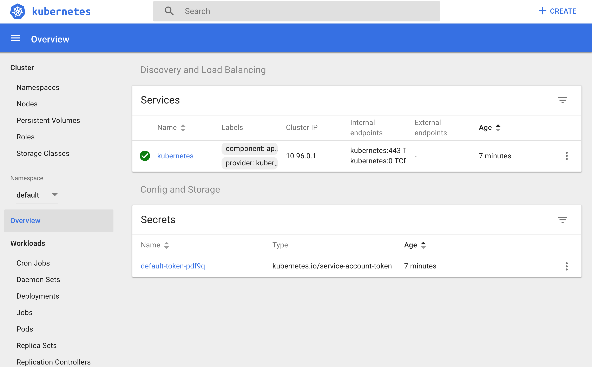
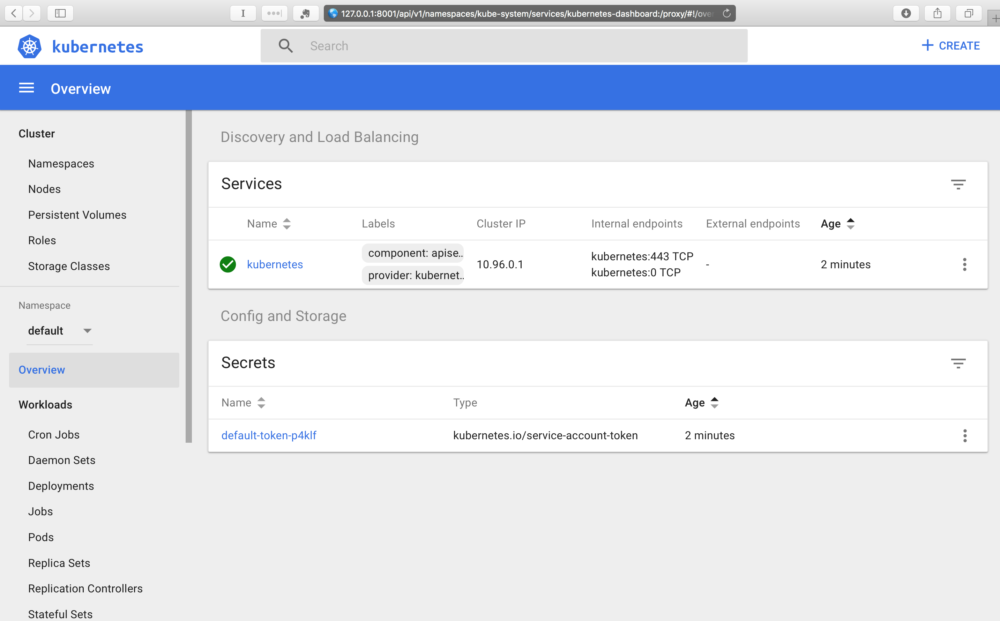

# Accessing Minikube

## Introduction

In this chapter, we will study the different access methods to any Kubernetes cluster. We will use `kubectl` to access **Minikube** via CLI, the **Kubernetes dashboard** to access it via GUI, and the **curl** command, with the right credentials to access it via APIs.

## Learning Objectives

By the end of this chapter, you should be able to:

- Review methods to access any Kubernetes cluster.
- Configure kubectl for Linux, macOS, and Windows.
- Access the Minikube dashboard.
- Access Minikube via APIs.

## Accessing Minikube

Any healthy running Kubernetes cluster can be accessed via one of the following methods:

- **Command Line Interface (CLI)**
- **Graphical User Interface (GUI)**
- **APIs**.

These methods are applicable to all Kubernetes clusters.

## Accessing Minikube: Command Line Interface (CLI)

[kubectl](https://kubernetes.io/docs/user-guide/kubectl/) is the **Command Line Interface (CLI)** tool to manage the Kubernetes cluster resources and applications. In later chapters, we will be using kubectl to deploy the applications and manage the Kubernetes resources.

## Accessing Minikube: Graphical User Interface (GUI)

The Kubernetes dashboard provides the **Graphical User Interface (GUI)** to interact with its resources and containerized applications. In one of the later chapters, we will be using it to deploy a containerized application.

## Accessing Minikube: APIs

As we know, Kubernetes has the **API server**, and operators/users connect to it from the external world to interact with the cluster. Using both CLI and GUI, we can connect to the API server on the master node to perform different operations. We can directly connect to the API server using its API endpoints and send commands to it, as long as we can access the master node and have the right credentials.

Below, you can find a part of the HTTP API space of Kubernetes:

 <!-- {width=982 height=633} -->

HTTP API space of Kubernetes can be divided into three independent groups:

- **Core Group (/api/v1)**  
  This group includes objects such as Pods, Services, nodes, etc.
- **Named Group**  
  This group includes objects in `/apis/$NAME/$VERSION` format. These different API versions imply different levels of stability and support:
  _Alpha level_ - it may be dropped at any point in time, without notice. For example, `/apis/batch/v2alpha1`.  
  _Beta level_ - it is well-tested, but the semantics of objects may change in incompatible ways in a subsequent beta or stable release. For example, `/apis/certificates.k8s.io/v1beta1`.  
  _Stable level_ - appears in released software for many subsequent versions. For example, `/apis/networking.k8s.io/v1`.
- **System-wide**  
  This group consists of system-wide API endpoints, like `/healthz`, `/logs`, `/metrics`, `/ui`, etc.

We can either connect to an API server directly via calling the respective API endpoints, or via the CLI/GUI.

Next, we will see how we can access the Minikube environment we set up in the previous chapter.

## kubectl

**kubectl** is generally installed before installing Minikube, but we can also install it later. There are different methods that can be used to install kubectl, which are mentioned in the [Kubernetes documentation](https://kubernetes.io/docs/tasks/tools/install-kubectl/). Next, we will look at the steps to install kubectl on Linux, macOS, and Windows systems.

## Installing kubectl on Linux

To install kubectl on Linux, follow the instructions below:

**Download the latest stable kubectl binary**

```
$ curl \
-LO https://storage.googleapis.com/kubernetes-release/release/$(curl -s https://storage.googleapis.com/kubernetes-release/release/stable.txt)/bin/linux/amd64/kubectl
```

**Make the kubectl binary executable**

`$ chmod +x ./kubectl`

**Move the kubectl binary to the PATH**

`$ sudo mv ./kubectl /usr/local/bin/kubectl`

## Installing kubectl on macOS

There are two ways to install kubectl on macOS: manually and using the Homebrew package manager. Next, we will provide instructions for both methods.

To manually install kubectl on macOS, follow the instructions below:

**Download the latest stable kubectl binary**

```
$ curl -LO \
https://storage.googleapis.com/kubernetes-release/release/$(curl -s https://storage.googleapis.com/kubernetes-release/release/stable.txt)/bin/darwin/amd64/kubectl
```

**Make the kubectl binary executable**

`$ chmod +x ./kubectl`

**Move the kubectl binary to the PATH**

`$ sudo mv ./kubectl /usr/local/bin/kubectl`

To install kubectl on macOS using the [Homebrew package manager](https://brew.sh/):

**Use the following command**

`$ brew install kubectl`

## Installing kubectl on Windows

To install kubectl on Windows, follow the steps below:

**Get the latest kubectl release from [here](https://storage.googleapis.com/kubernetes-release/release/stable.txt)**

**Depending on the latest release, download the kubectl binary**
In the example below, we are downloading the v1.9.3 release:

```$ curl -LO \
https://storage.googleapis.com/kubernetes-release/release/v1.9.3/bin/windows/amd64/kubectl.exe
```

**Once downloaded, move the kubectl binary to the PATH.**

## kubectl Configuration File

To connect to the Kubernetes cluster, kubectl needs the master node endpoint and the credentials to connect to it. While starting Minikube, the startup process creates, by default, a configuration file, `config`, inside the `.kube` directory, which resides in the user's `home` directory. That configuration file has all the connection details. By default, the kubectl binary accesses this file to find the master node's connection endpoint, along with the credentials. To look at the connection details, we can either see the content of the `~/.kube/config(Linux)` file, or run the following command:

```
$ kubectl config view
apiVersion: v1
clusters:
- cluster:
    certificate-authority: /Users/nkhare/.minikube/ca.crt
    server: https://192.168.99.100:8443
  name: minikube
contexts:
- context:
    cluster: minikube
    user: minikube
  name: minikube
current-context: minikube
kind: Config
preferences: {}
users:
- name: minikube
  user:
    client-certificate: /Users/nkhare/.minikube/apiserver.crt
    client-key: /Users/nkhare/.minikube/apiserver.key
```

Once kubectl is installed, we can get information about the Minikube cluster with the `kubectl cluster-info` command:

```
$ kubectl cluster-info
Kubernetes master is running at https://192.168.99.100:8443

To further debug and diagnose cluster problems, use
'kubectl cluster-info dump'.
```

You can find more details about the kubectl command line options [here](https://kubernetes.io/docs/user-guide/kubectl-overview/).

## Using the 'minikube dashboard' Command

As mentioned earlier, the [Kubernetes dashboard](https://kubernetes.io/docs/tasks/access-application-cluster/web-ui-dashboard/) provides the user interface for the Kubernetes cluster. To access the dashboard of Minikube, we can use `minikube dashboard`, which would open a new tab on our web browser, displaying the Kubernetes dashboard:

`$ minikube dashboard`



<!-- {width=756 height=487} -->

## Using the 'kubectl proxy' Command

Using the `kubectl proxy` command, `kubectl` would authenticate with the API server on the master node and would make the dashboard available on `http://127.0.0.1:8001/api/v1/namespaces/kube-system /services/kubernetes-dashboard:/proxy/#!/overview?namespace=default`, as the `kubernetes-dashboard` service runs inside the `kube-system` namespace.

```
$ kubectl proxy
Starting to serve on 127.0.0.1:8001
```

After running the above command, we can access the dashboard at `http://127.0.0.1:8001/api/v1/namespaces/kube-system/services /kubernetes-dashboard:/proxy/#!/overview?namespace=default`.



<!-- {width=771 height=497} -->

## APIs - with 'kubectl proxy'

When `kubectl proxy` is configured, we can send requests to `localhost` on the `proxy` port:

```
$ curl http://localhost:8001/
{
 "paths": [
   "/api",
   "/api/v1",
   "/apis",
   "/apis/apps",
   ......
   ......
   "/logs",
   "/metrics",
   "/swaggerapi/",
   "/ui/",
   "/version"
 ]
}%
```

With the above `curl` request, we requested all the API endpoints from the API server.

## APIs - without 'kubectl proxy'

Without `kubectl proxy` configured, we can get the **Bearer Token** using `kubectl`, and then send it with the API request. A **Bearer Token** is an **access token** which is generated by the authentication server (the API server on the master node) and given back to the client. Using that token, the client can connect back to the Kubernetes API server without providing further authentication details, and then, access resources.

**Get the token**

`TOKEN=$(kubectl describe secret -n kube-system $(kubectl get secrets -n kube-system | grep default | cut -f1 -d ' ') | grep -E '^token' | cut -f2 -d':' | tr -d '\t' | tr -d " ")`

**Get the API server endpoint**

`$ APISERVER=$(kubectl config view | grep https | cut -f 2- -d ":" | tr -d " ")`

**Make sure the APISERVER is pointing to your Minikube's IP** (for example, in our case, it is pointing to Minikube's IP `192.168.99.100:8443`)

```
$ echo $APISERVER
https://192.168.99.100:8443
```

**Access the API Server using the curl command, as shown below**

```
$ curl $APISERVER --header "Authorization: Bearer $TOKEN" \
--insecure
{
 "paths": [
   "/api",
   "/api/v1",
   "/apis",
   "/apis/apps",
   ......
   ......
   "/logs",
   "/metrics",
   "/swaggerapi/",
   "/ui/",
   "/version"
 ]
}%
```

## Learning Objectives (Review)

You should now be able to:

- Review methods to access any Kubernetes cluster.
- Configure kubectl for Linux, macOS, and Windows.
- Access the Minikube dashboard.
- Access Minikube via APIs.
