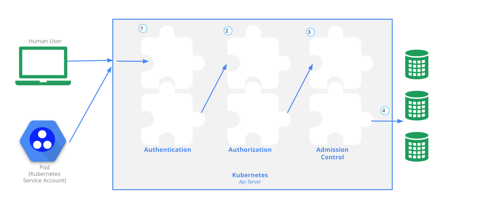

# Authentication, Authorization, Admission Control

## Introduction

In this chapter, we will be looking into the Authentication, Authorization and Admission Control stages of Kubernetes API requests.

## Learning Objectives

By the end of this chapter, you should be able to:

- Discuss authentication, authorization, and access control stages of the Kubernetes API access.
- Understand the different kinds of Kubernetes users.
- Explore the different modules for authentication and authorization.

## Authentication, Authorization, and Admission Control - Overview

To access and manage any resources/objects in the Kubernetes cluster, we need to access a specific API endpoint on the API server. Each access request goes through the following three stages:

- **Authentication**  
  Logs in a user.
- **Authorization**  
  Authorizes the API requests added by the logged-in user.
- **Admission Control**  
  Software modules that can modify or reject the requests based on some additional checks, like **Quota**.

The following image depicts the above stages:

 <!-- {width=692 height=307} -->

## Authentication

Kubernetes does not have an object called _user_, nor does it store _usernames_ or other related details in its object store. However, even without that, Kubernetes can use usernames for access control and request logging, which we will explore in this chapter.

Kubernetes has two kinds of users:

- **Normal Users**
  They are managed outside of the Kubernetes cluster via independent services like User/Client Certificates, a file listing usernames/passwords, Google accounts, etc.
- **Service Accounts**  
  With Service Account users, in-cluster processes communicate with the API server to perform different operations. Most of the Service Account users are created automatically via the API server, but they can also be created manually. The Service Account users are tied to a given Namespace and mount the respective credentials to communicate with the API server as Secrets.

If properly configured, Kubernetes can also support **anonymous requests**, along with requests from Normal Users and Service Accounts.

For authentication, Kubernetes uses different [authenticator modules](https://kubernetes.io/docs/admin/authentication/#authentication-strategies):

- **Client Certificates**  
  To enable client certificate authentication, we need to reference a file containing one or more certificate authorities by passing the `--client-ca-file=SOMEFILE` option to the API server. The certificate authorities mentioned in the file would validate the client certificates presented to the API server. A demonstration video covering this topic is also available at the end of this chapter.
- **Static Token File**  
  We can pass a file containing pre-defined bearer tokens with the `--token-auth-file=SOMEFILE` option to the API server. Currently, these tokens would last indefinitely, and they cannot be changed without restarting the API server.
- **Bootstrap Tokens**  
  This feature is currently in an alpha status, and is mostly used for bootstrapping a new Kubernetes cluster.
- **Static Password File**  
  It is similar to Static Token File. We can pass a file containing basic authentication details with the `--basic-auth-file=SOMEFILE` option. These credentials would last indefinitely, and passwords cannot be changed without restarting the API server.
- **Service Account Tokens**  
  This is an automatically enabled authenticator that uses signed bearer tokens to verify the requests. These tokens get attached to Pods using the ServiceAccount Admission Controller, which allows in-cluster processes to talk to the API server.
- **OpenID Connect Tokens**  
  OpenID Connect helps us connect with OAuth 2 providers, such as Azure Active Directory, Salesforce, Google, etc., to offload the authentication to external services.
- **Webhook Token Authentication**  
  With Webhook-based authentication, verification of bearer tokens can be offloaded to a remote service.
- **Keystone Password**  
  Keystone authentication can be enabled by passing the `--experimental-keystone-url=<AuthURL>` option to the API server, where AuthURL is the Keystone server endpoint.
- **Authenticating Proxy**  
  If we want to program additional authentication logic, we can use an authenticating proxy.

We can enable multiple authenticators, and the first module to successfully authenticate the request short-circuits the evaluation. In order to be successful, you should enable at least two methods: the service account tokens authenticator and the user authenticator.

## Authorization

After a successful authentication, users can send the API requests to perform different operations. Then, those API requests get authorized by Kubernetes using various authorization modules.

Some of the API request attributes that are reviewed by Kubernetes include user, group, extra, Resource or Namespace, to name a few. Next, these attributes are evaluated against policies. If the evaluation is successful, then the request will be allowed, otherwise it will get denied. Similar to the Authentication step, Authorization has multiple modules/authorizers. More than one module can be configured for one Kubernetes cluster, and each module is checked in sequence. If any authorizer approves or denies a request, then that decision is returned immediately.

Next, we will discuss the authorizers that are supported by Kubernetes.

Authorization modules:

- **Node Authorizer**
  Node authorization is a special-purpose authorization mode which specifically authorizes API requests made by kubelets. It authorizes the kubelet's read operations for services, endpoints, nodes, etc., and writes operations for nodes, pods, events, etc. For more details, please review the [Kubernetes documentation](https://kubernetes.io/docs/admin/authorization/node/).
- **Attribute-Based Access Control (ABAC) Authorizer**  
  With the ABAC authorizer, Kubernetes grants access to API requests, which combine policies with attributes. In the following example, user _nkhare_ can only read Pods in the Namespace `lfs158`.

```yaml
  {
    "apiVersion": "abac.authorization.kubernetes.io/v1beta1",
    "kind": "Policy",
    "spec": { "user": "nkhare", "namespace": "lfs158", "resource": "pods", "readonly": true },
  }
```

  To enable the ABAC authorizer, we would need to start the API server with the `--authorization-mode=ABAC` option. We would also need to specify the authorization policy, like `--authorization-policy-file=PolicyFile.json`. For more details, please review the [Kubernetes documentation](https://kubernetes.io/docs/admin/authorization/abac/).

- **Webhook Authorizer**
  With the Webhook authorizer, Kubernetes can offer authorization decisions to some third-party services, which would return _true_ for successful authorization, and _false_ for failure. In order to enable the Webhook authorizer, we need to start the API server with the `--authorization-webhook-config-file=SOME_FILENAME` option, where `SOME_FILENAME` is the configuration of the remote authorization service. For more details, please see the [Kubernetes documentation](https://kubernetes.io/docs/admin/authorization/webhook/).
- **Role-Based Access Control (RBAC) Authorizer**  
   In general, with RBAC we can regulate the access to resources based on the roles of individual users. In Kubernetes, we can have different roles that can be attached to subjects like users, service accounts, etc. While creating the roles, we restrict resource access by specific operations, such as `create`, `get`, `update`, `patch`, etc. These operations are referred to as verbs.

  In RBAC, we can create two kinds of roles:

  **Role**
  With Role, we can grant access to resources within a specific Namespace.

  **ClusterRole**  
   The ClusterRole can be used to grant the same permissions as Role does, but its scope is cluster-wide.

  In this course, we will focus on the first kind, **Role**. Below you will find an example:

```yaml
  kind: Role
  apiVersion: rbac.authorization.k8s.io/v1
  metadata:
    namespace: lfs158
    name: pod-reader
  rules:
    - apiGroups: [""] # "" indicates the core API group
      resources: ["pods"]
      verbs: ["get", "watch", "list"]
```

  As you can see, it creates a pod-reader role, which has access only to the Pods of lfs158 Namespace. Once the role is created, we can bind users with _RoleBinding_.

  There are two kinds of _RoleBindings_:

  **_RoleBinding_**
  It allows us to bind users to the same namespace as a Role. We could also refer a ClusterRole in RoleBinding, which would grant permissions to Namespace resources defined in the ClusterRole within the RoleBinding’s Namespace.

  **_ClusterRoleBinding_**
  It allows us to grant access to resources at a cluster-level and to all Namespaces.

  In this course, we will focus on the first kind, **_RoleBinding_**. Below, you will find an example:

```yaml
  kind: RoleBinding
  apiVersion: rbac.authorization.k8s.io/v1
  metadata:
    name: pod-read-access
    namespace: lfs158
  subjects:
    - kind: User
      name: nkhare
      apiGroup: rbac.authorization.k8s.io
  roleRef:
    kind: Role
    name: pod-reader
    apiGroup: rbac.authorization.k8s.io
```

  As you can see, it gives access to nkhare to read the Pods of `lfs158` Namespace.

  To enable the RBAC authorizer, we would need to start the API server with the `--authorization-mode=RBAC` option. With the RBAC authorizer, we dynamically configure policies. For more details, please review the [Kubernetes documentation](https://kubernetes.io/docs/admin/authorization/rbac/).

## Admission Control

Admission control is used to specify granular access control policies, which include allowing privileged containers, checking on resource quota, etc. We force these policies using different admission controllers, like ResourceQuota, AlwaysAdmit, DefaultStorageClass, etc. They come into effect only after API requests are authenticated and authorized.

To use admission controls, we must start the Kubernetes API server with the `admission-control`, which takes a comma-delimited, ordered list of controller names, like in the following example:

```
--admission-control=NamespaceLifecycle,ResourceQuota,\
PodSecurityPolicy,DefaultStorageClass
```

By default, Kubernetes comes with some built-in admission controllers. For more details, please review the [Kubernetes documentation](https://kubernetes.io/docs/admin/admission-controllers/#defaultstorageclass).

## Authentication and Authorization (Demo)

[Authentication and Authorization](https://www.youtube.com/watch?v=qWuznmEESac)

## Learning Objectives (Review)

You should now be able to:

- Discuss authentication, authorization, and access control stages of the Kubernetes API access.
- Understand the different kinds of Kubernetes users.
- Discuss the different modules for authentication and authorization.
