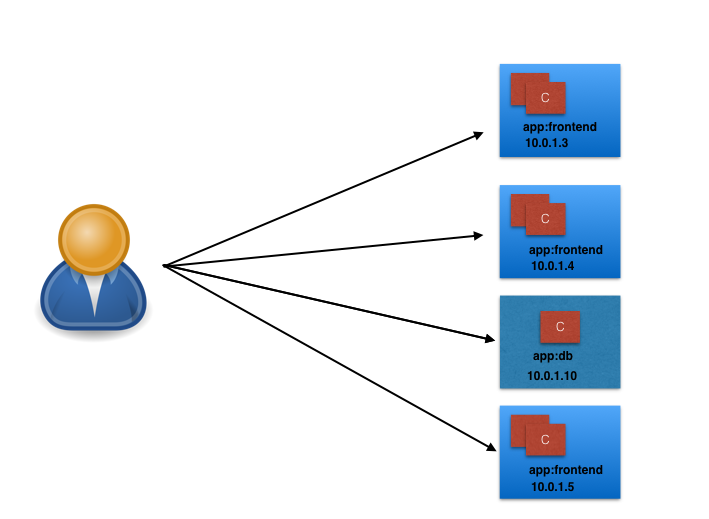
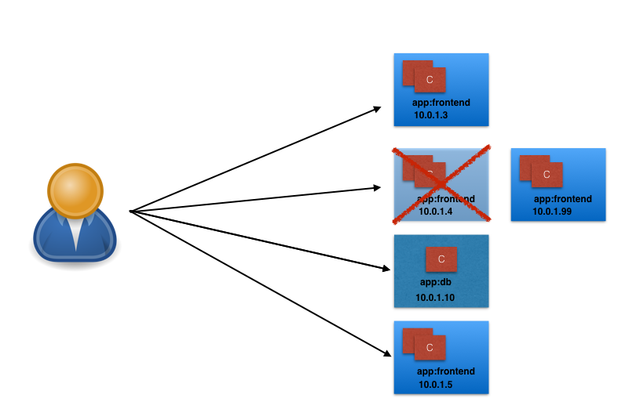
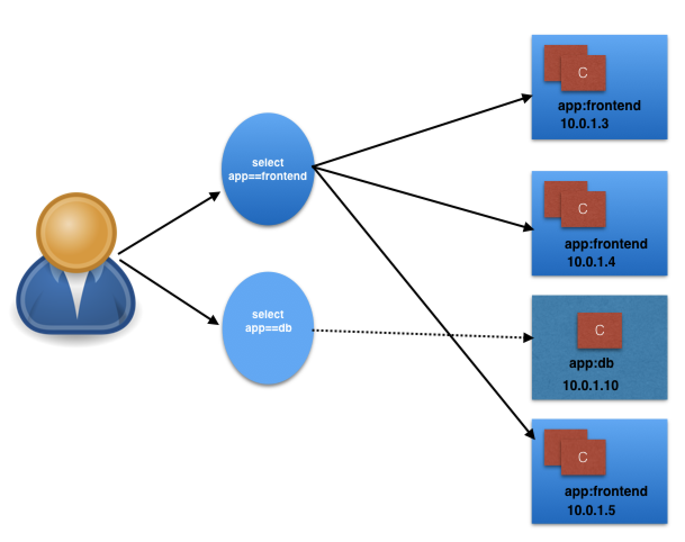
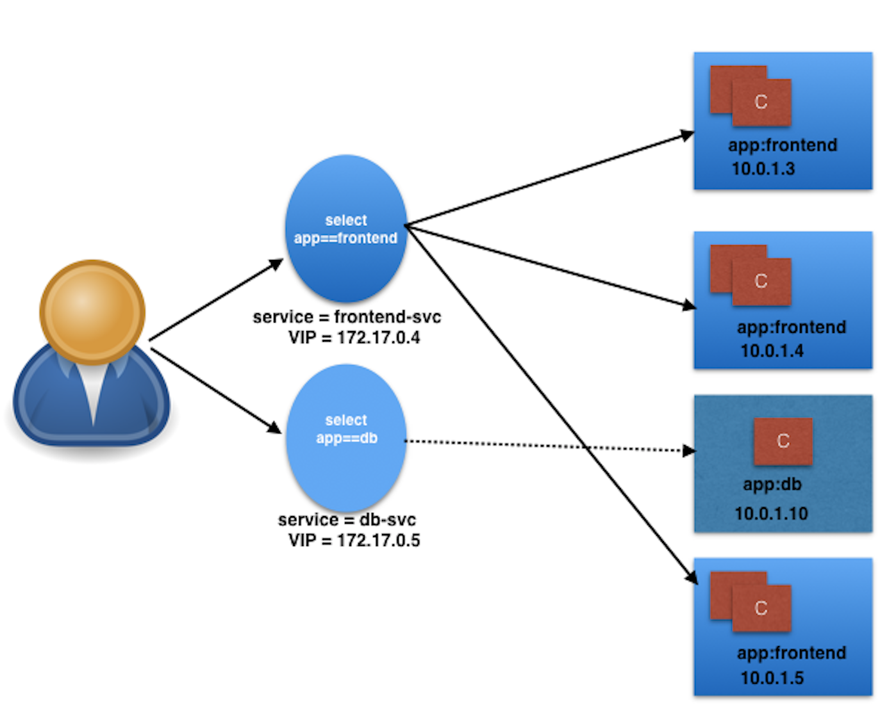
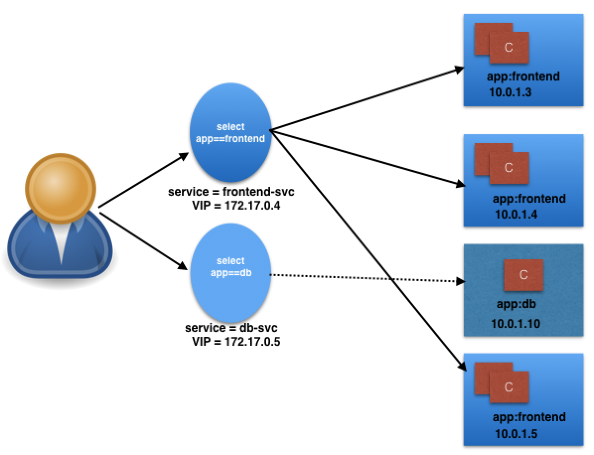
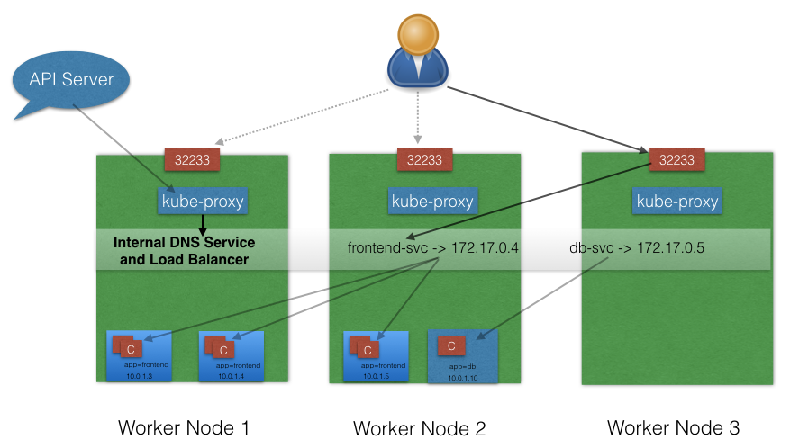
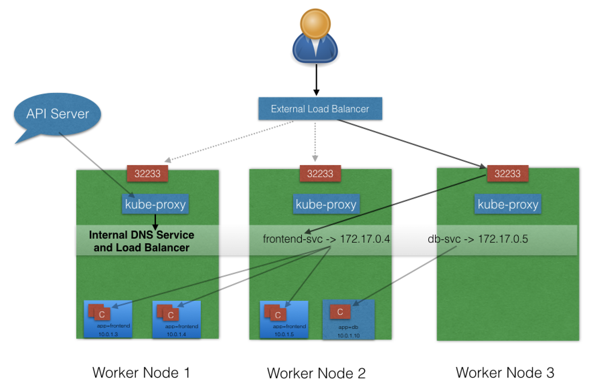
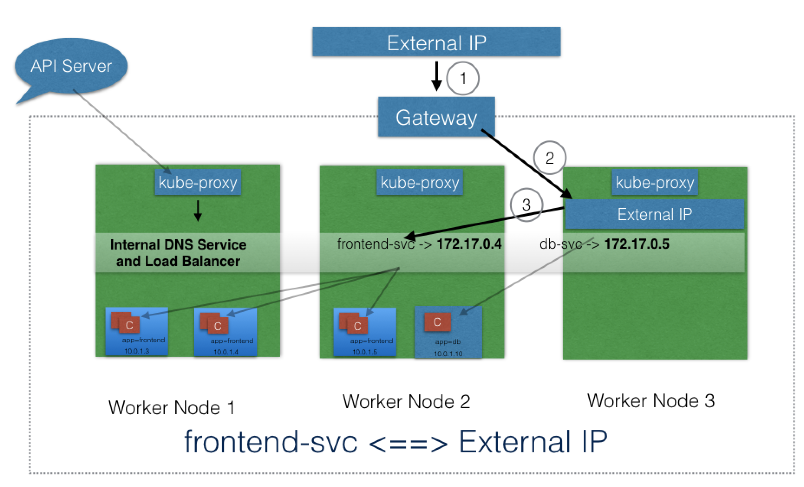

# Services

## Introduction

In this chapter, we will learn about **Services**, using which we can group Pods to provide common access points from the external world. We will learn about the `kube-proxy` daemon, which runs on each worker node to provide access to services. We will also discuss about **service discovery** and **service types**, which decide the access scope of a service.

## Learning Objectives

By the end of this chapter, you should be able to:

- Discuss the benefits of grouping Pods into Services to access an application.
- Explain the role of the `kube-proxy` daemon running on each worker node.
- Explore the Service discovery options available in Kubernetes.
- Discuss different Service types.

## Connecting Users to Pods

To access the application, a user/client needs to connect to the Pods. As Pods are ephemeral in nature, resources like IP addresses allocated to it cannot be static. Pods could die abruptly or be rescheduled based on existing requirements.

Let's take, for example, a scenario in which a user/client is connected to a Pod using its IP address.

{width=433 height=317}

Unexpectedly, the Pod to which the user/client is connected dies, and a new Pod is created by the controller. The new Pod will have a new IP address, which will not be known automatically to the user/client of the earlier Pod.



<!-- {width=433 height=317} -->

To overcome this situation, Kubernetes provides a higher-level abstraction called [Service](https://kubernetes.io/docs/concepts/services-networking/service/), which logically groups Pods and a policy to access them. This grouping is achieved via **Labels** and **Selectors**, which we talked about in the previous chapter.

## Services

For example, in the following graphical representation we have used the `app` keyword as a Label, and `frontend` and `db` as values for different Pods.



<!-- {width=719 height=507} -->
Using selectors (`app==frontend` and `app==db`), we can group them into two logical groups: one with 3 Pods, and one with just one Pod.

We can assign a name to the logical grouping, referred to as a **Service name**. In our example, we have created two Services, `frontend-svc` and `db-svc`, and they have the `app==frontend` and the `app==db` Selectors, respectively.



<!-- {width=719 height=507} -->
## Service Object Example

The following is an example of a Service object:

```yaml
kind: Service
apiVersion: v1
metadata:
  name: frontend-svc
spec:
  selector:
    app: frontend
  ports:
    - protocol: TCP
      port: 80
      targetPort: 5000
```

In this example, we are creating a `frontend-svc` Service by selecting all the Pods that have the Label `app` set to the `frontend`. By default, each Service also gets an IP address, which is routable only inside the cluster. In our case, we have `172.17.0.4` and `172.17.0.5` IP addresses for our `frontend-svc` and `db-svc` Services, respectively. The IP address attached to each Service is also known as the ClusterIP for that Service.



<!-- {width=719 height=507} -->
The user/client now connects to a service via the IP address, which forwards the traffic to one of the Pods attached to it. A service does the load balancing while selecting the Pods for forwarding the data/traffic.

While forwarding the traffic from the Service, we can select the target port on the Pod. In our example, for `frontend-svc`, we will receive requests from the user/client on Port `80`. We will then forward these requests to one of the attached Pods on Port `5000`. If the target port is not defined explicitly, then traffic will be forwarded to Pods on the port on which the Service receives traffic.

A tuple of Pods, IP addresses, along with the targetPort is referred to as a **Service endpoint**. In our case, frontend-svc has 3 endpoints: `10.0.1.3:5000`, `10.0.1.4:5000`, and `10.0.1.5:5000`.

## kube-proxy

All of the worker nodes run a daemon called [kube-proxy](https://kubernetes.io/docs/concepts/services-networking/service/#virtual-ips-and-service-proxies), which watches the API server on the master node for the addition and removal of Services and endpoints. For each new Service, on each node, `kube-proxy` configures the iptables rules to capture the traffic for its ClusterIP and forwards it to one of the endpoints. When the service is removed, `kube-proxy` removes the iptables rules on all nodes as well.

[kube-proxy and services and endpoints](assets/09-kubeproxy.png "kube-proxy, Services, and Endpoints")

<!-- {width=745 height=407} -->

## Service Discovery

As Services are the primary mode of communication in Kubernetes, we need a way to discover them at runtime. Kubernetes supports two methods of discovering a Service:

- **Environment Variables**  
  As soon as the Pod starts on any worker node, the `kubelet` daemon running on that node adds a set of environment variables in the Pod for all active Services. For example, if we have an active Service called `redis-master`, which exposes port `6379`, and its ClusterIP is `172.17.0.6`, then, on a newly created Pod, we can see the following environment variables:

```
  REDIS_MASTER_SERVICE_HOST=172.17.0.6
  REDIS_MASTER_SERVICE_PORT=6379
  REDIS_MASTER_PORT=tcp://172.17.0.6:6379
  REDIS_MASTER_PORT_6379_TCP=tcp://172.17.0.6:6379
  REDIS_MASTER_PORT_6379_TCP_PROTO=tcp
  REDIS_MASTER_PORT_6379_TCP_PORT=6379
  REDIS_MASTER_PORT_6379_TCP_ADDR=172.17.0.6
```

  With this solution, we need to be careful while ordering our Services, as the Pods will not have the environment variables set for Services which are created after the Pods are created.

- **DNS**
  Kubernetes has an [add-on](https://github.com/kubernetes/kubernetes/blob/master/cluster/addons/README.md) for [DNS](https://github.com/kubernetes/kubernetes/tree/master/cluster/addons/dns), which creates a DNS record for each Service and its format is like `my-svc.my-namespace.svc.cluster.local`. Services within the same Namespace can reach to other Services with just their name. For example, if we add a Service `redis-master` in the `my-ns` Namespace, then all the Pods in the same Namespace can reach to the redis Service just by using its name, `redis-master`. Pods from other Namespaces can reach the Service by adding the respective Namespace as a suffix, like `redis-master.my-ns`.

  This is the most common and highly recommended solution. For example, in the previous section's image, we have seen that an internal DNS is configured, which maps our Services `frontend-svc` and `db-svc` to `172.17.0.4` and `172.17.0.5`, respectively.

## ServiceType

While defining a Service, we can also choose its access scope. We can decide whether the Service:

- Is only accessible within the cluster
- Is accessible from within the cluster and the external world
- Maps to an external entity which resides outside the cluster.

Access scope is decided by _ServiceType_, which can be mentioned when creating the Service.

## ServiceType: ClusterIP and NodePort

**ClusterIP** is the default _ServiceType_. A Service gets its Virtual IP address using the ClusterIP. That IP address is used for communicating with the Service and is accessible only within the cluster.

With the **NodePort** _ServiceType_, in addition to creating a ClusterIP, a port from the range `30000-32767` is mapped to the respective Service, from all the worker nodes. For example, if the mapped NodePort is `32233` for the service `frontend-svc`, then, if we connect to any worker node on port `32233`, the node would redirect all the traffic to the assigned ClusterIP - `172.17.0.4`.

By default, while exposing a NodePort, a random port is automatically selected by the Kubernetes Master from the port range `30000-32767`. If we don't want to assign a dynamic port value for NodePort, then, while creating the service, we can also give a port number from the earlier specific range.



<!-- {width=768 height=483} -->

The **NodePort** _ServiceType_ is useful when we want to make our Services accessible from the external world. The end-user connects to the worker nodes on the specified port, which forwards the traffic to the applications running inside the cluster. To access the application from the external world, administrators can configure a reverse proxy outside the Kubernetes cluster and map the specific endpoint to the respective port on the worker nodes.

## ServiceType: LoadBalancer

With the **LoadBalancer** _ServiceType_:

- NodePort and ClusterIP Services are automatically created, and the external load balancer will route to them
- The Services are exposed at a static port on each worker node
- The Service is exposed externally using the underlying cloud provider's load balancer feature.



<!-- {width=898 height=574} -->

The LoadBalancer _ServiceType_ will only work if the underlying infrastructure supports the automatic creation of Load Balancers and have the respective support in Kubernetes, as is the case with the Google Cloud Platform and AWS.

## ServiceType: ExternalIP

A Service can be mapped to an **ExternalIP** address if it can route to one or more of the worker nodes. Traffic that is ingressed into the cluster with the ExternalIP (as destination IP) on the Service port, gets routed to one of the the Service endpoints.



<!-- {width=799 height=502} -->

Please note that ExternalIPs are not managed by Kubernetes. The cluster administrators has configured the routing to map the ExternalIP address to one of the nodes.

## ServiceType: ExternalName

**ExternalName** is a special _ServiceType_, that has no Selectors and does not define any endpoints. When accessed within the cluster, it returns a `CNAME` record of an externally configured Service.

The primary use case of this _ServiceType_ is to make externally configured Services like `my-database.example.com` available inside the cluster, using just the name, like `my-database`, to other Services inside the same Namespace.

## Learning Objectives (Review)

You should now be able to:

- Discuss the benefits of grouping Pods into Services to access an application.
- Explain the role of the `kube-proxy` daemon running on each worker node.
- Explore the Service discovery options available in Kubernetes.
- Discuss different Service types.
