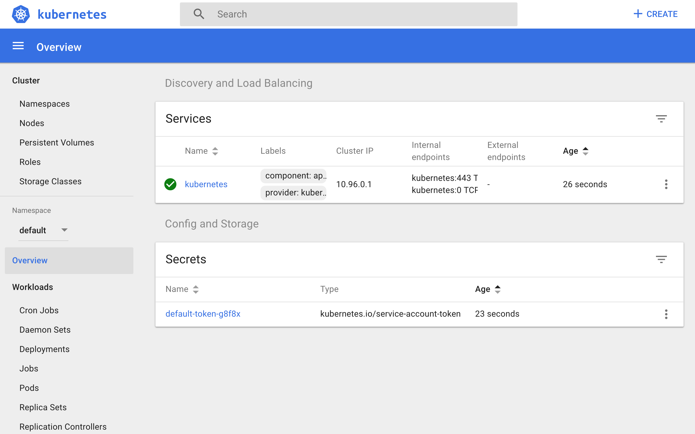
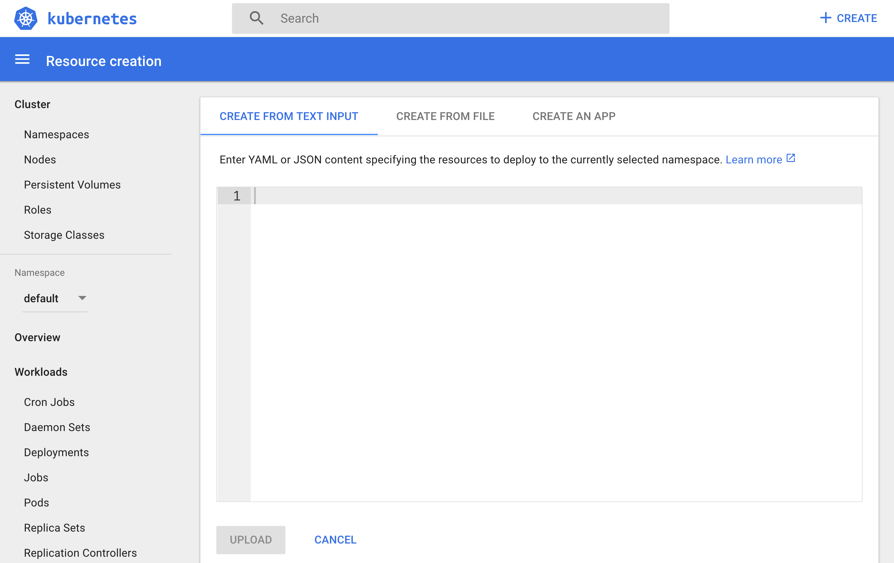
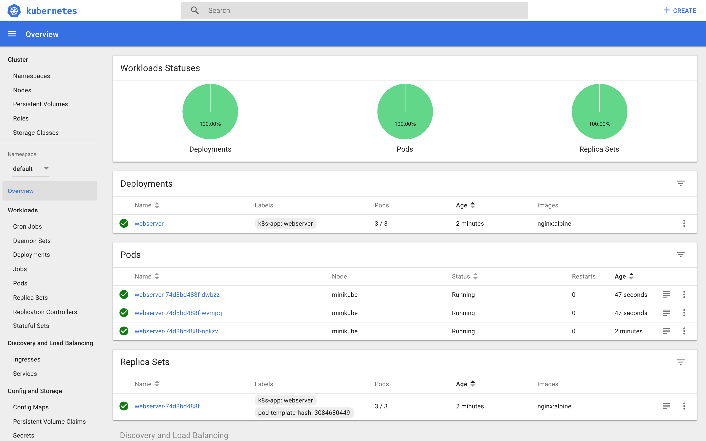
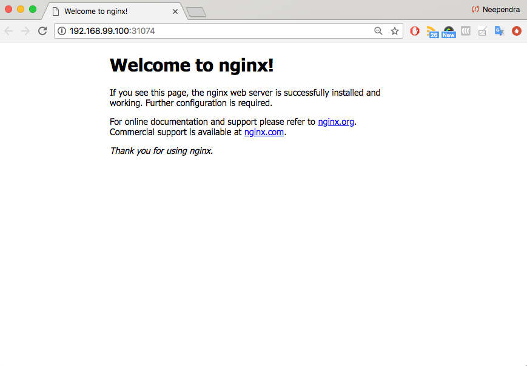

# Deploying a Stand-Alone Application

## Introduction

In this chapter, we will learn how to deploy an application using **Graphical User Interface (GUI)** or **Command Line Interface (CLI)**. We will also expose an application with NodePort, and access it from the external world.

## Learning Objectives

By the end of this chapter, you should be able to:

- Deploy an application from the dashboard.
- Deploy an application from a YAML file using kubectl.
- Expose a service using NodePort.
- Access the application from the external world.

## Deploying an Application Using the Minikube GUI

In the next few pages, we will learn how to deploy an `nginx` webserver using the `nginx:alpine` Docker image.

**Make sure that Minikube is running**  
To ensure that Minikube is running, run the following command:

```
$ minikube status
minikube: Running
cluster: Running
kubectl: Correctly Configured: pointing to minikube-vm
at 192.168.99.100
```

**Start the Minikube Dashboard**
To access the GUI (Dashboard), we need to run the following command:

`$ minikube dashboard`

Running this command will open up a browser with the Kubernetes GUI, which we can use to manage containerized applications. By default, the dashboard is connected to the `default` Namespace. So, all the operations that we will do in this chapter will be performed inside the `default` Namespace.

{}

**Deploy a webserver using the `nginx:alpine` image**  
From the dashboard, click on the _+CREATE_ tab at the top right section on the page. That will open an interface like the one below:

{}

<!-- {width=721 height=402px} -->

From that, we can create an application using a valid YAML/JSON content/file, or, manually, from the _CREATE AN APP_ section. Click on the _CREATE AN APP_ tab and provide the following application details:

- The application name is `webserver`
- The Docker image to use is `nginx:alpine`, where `alpine` is the image tag
- The replica count, or the number of Pods, is 3
- No Service, as we will be creating it later.


<!-- {width=924 height=548px} -->

If we click on _Show Advanced Options_, we can specify options such as Labels, Environment Variables, etc. By default, the `app` Label is set to the application name. In our example, an `k8s-app:webserver` Label is set to different objects created by this Deployment.

By clicking on the _Deploy_ button, we can trigger the deployment. As expected, the Deployment `webserver` will create a ReplicaSet (`webserver-74d8bd488f`), which will eventually create three Pods (`webserver-74d8bd488f-xxxx`).



<!-- {width=721 height=402px} -->

We can also list the Deployments, ReplicaSets, and Pods from the CLI, which we created using the GUI. They will match one-to-one.

**List the Deployments**  
We can list all the Deployments in the given Namespace using the `kubectl get deployments` command:

```
$ kubectl get deployments
NAME        DESIRED   CURRENT   UP-TO-DATE   AVAILABLE   AGE
webserver   3         3         3            3           9m
```

**List the ReplicaSets**  
We can list all the ReplicaSets in the given Namespace using the `kubectl get replicasets` command:

```
$ kubectl get replicasets
NAME                   DESIRED   CURRENT   READY   AGE
webserver-74d8bd488f   3         3         3       9m
```

**List the Pods**  
We can list all the Pods in the given namespace using the `kubectl get pods` command:

```
$ kubectl get pods
NAME                          READY   STATUS    RESTARTS   AGE
webserver-74d8bd488f-dwbzz    1/1     Running   0          9m
webserver-74d8bd488f-npkzv    1/1     Running   0          9m
webserver-74d8bd488f-wvmpq    1/1     Running   0          9m
```

## Exploring Labels and Selectors

Earlier, we have seen that labels and selectors play an important role in grouping a subset of objects on which we can perform operations. Next, we will take a closer look at them.

**Look at a Pod's Details**  
We can look at an object's details using `kubectl`'s `describe` subcommand. In the following example, you can see a Pod's description:

```
$ kubectl describe pod  webserver-74d8bd488f-dwbzz
Name:           webserver-74d8bd488f-dwbzz
Namespace:      default
Node:           minikube/192.168.99.100
Start Time:     Thu, 22 Mar 2018 09:17:33 +0530
Labels:         k8s-app=webserver
                pod-template-hash=3084680449
Annotations:    <none>
Status:         Running
IP:             172.17.0.5
Controlled By:  ReplicaSet/webserver-74d8bd488f
Containers:
  webserver:
    Container ID:   docker://96302d70903fe3b45d5ff3745a706d67d77411c5378f1f293a4bd721896d6420
    Image:          nginx:alpine
    Image ID:       docker-pullable://nginx@sha256:8d5341da24ccbdd195a82f2b57968ef5f95bc27b3c3691ace0c7d0acf5612edd
    Port:           <none>
    State:          Running
      Started:      Thu, 22 Mar 2018 09:17:33 +0530
    Ready:          True
    Restart Count:  0
```

As you were able to see, with `kubectl`'s `describe` subcommand, we can get all the details of a Pod. For now, we will focus on the `Labels` field, in which we have a Label set to `k8s-app=webserver`.

**List the Pods, along with their attached Labels**  
With the `-L` option to the `kubectl get pods` command, we can add additional columns in the output to list Pods with their attached Labels and their values. In the following example, we are listing Pods with the Labels `k8s-app` and `label2`:

```
$ kubectl get pods -L k8s-app,label2
NAME                         READY   STATUS    RESTARTS   AGE   K8S-APP     LABEL2
webserver-74d8bd488f-dwbzz   1/1     Running   0          14m   webserver   <none>
webserver-74d8bd488f-npkzv   1/1     Running   0          14m   webserver   <none>
webserver-74d8bd488f-wvmpq   1/1     Running   0          14m   webserver   <none>
```

All of the Pods are listed, as each Pod has the Label `k8s-app`, whose value is set to `webserver`. We can see that in the `K8S-APP` column. As none of the Pods has the `label2` Label, the value `<none>` is listed under the `LABEL2` column.

**Select the Pods with a given Label**  
To use a selector with the `kubectl get pods` command, we can use the `-l` option. In the following example, we are selecting all the Pods that have the `k8s-app` Label's value set to `webserver`:

```
$ kubectl get pods -l k8s-app=webserver
NAME                         READY     STATUS    RESTARTS   AGE
webserver-74d8bd488f-dwbzz   1/1       Running   0          17m
webserver-74d8bd488f-npkzv   1/1       Running   0          19m
webserver-74d8bd488f-wvmpq   1/1       Running   0          17m
```

In the example above, we listed all the Pods we created, as all of them have the `k8s-app` Label, whose value is set to `webserver`.

**Try using `k8s-app=webserver1` as the Selector**

```
$ kubectl get pods -l k8s-app=webserver1
No resources found.
```

As expected, no Pods are listed.

## Deploying the Application Using the CLI

To deploy an application using the CLI, let us first delete the Deployment we created earlier.

**Delete the Deployment we created earlier**  
We can delete any object using the kubectl delete command. In the following example, we are deleting the webserver Deployment, which was created in the previous section using the Dashboard:

```
$ kubectl delete deployments webserver
deployment "webserver" deleted
```

Deleting a Deployment also deletes the ReplicaSets and the Pods we created:

```
$ kubectl get replicasets
No resources found.

$ kubectl get pods
No resources found.
```

**Create a YAML file with Deployment details**  
Let us now create the `webserver.yaml` file with the following content:

```yaml
apiVersion: apps/v1
kind: Deployment
metadata:
  name: webserver
  labels:
    app: nginx
spec:
  replicas: 3
  selector:
    matchLabels:
      app: nginx
  template:
    metadata:
      labels:
        app: nginx
    spec:
      containers:
      - name: nginx
        image: nginx:alpine
        ports:
        - containerPort: 80
```

Using `kubectl`, we will create the Deployment from the YAML file. Using the `-f` option with the `kubectl create` command, we can pass a YAML file as an object's specification. In the following example, we are creating a `webserver` Deployment:

```
$ kubectl create -f webserver.yaml
deployment "webserver" created
```

This will also create a ReplicaSet and Pods, as defined.

```
$  kubectl get replicasets
NAME                  DESIRED   CURRENT   READY     AGE
webserver-b477df957   3         3         3         45s

$ kubectl get pods
NAME                        READY     STATUS    RESTARTS   AGE
webserver-b477df957-7lnw6   1/1       Running   0          1m
webserver-b477df957-j69q2   1/1       Running   0          1m
webserver-b477df957-xvdkf   1/1       Running   0          1m
```

## Creating a Service and Exposing It to the External World with NodePort

In a previous chapter, we looked at different _ServiceTypes_. With _ServiceTypes_ we can define the access method for a given Service. For a given Service, with the `NodePort`  _ServiceType_, Kubernetes opens up a static port on all the worker nodes. If we connect to that port from any node, we are forwarded to the respective Service. Next, let us use the `NodePort`  _ServiceType_ and create a Service.

**Create a `webserver-svc.yaml` file with the following content:**

```yaml
apiVersion: v1
kind: Service
metadata:
  name: web-service
  labels:
    run: web-service
spec:
  type: NodePort
  ports:
  - port: 80
    protocol: TCP
  selector:
    app: nginx
```

**Using kubectl, create the Service:**

```
$ kubectl create -f webserver-svc.yaml
service "web-service" created
```

**List the Services**:

```
$ kubectl get svc
NAME          TYPE        CLUSTER-IP     EXTERNAL-IP   PORT(S)        AGE
kubernetes    ClusterIP   10.96.0.1      <none>        443/TCP        1d
web-service   NodePort    10.110.47.84   <none>        80:31074/TCP   12s
```

Our `web-service` is now created and its ClusterIP is `10.110.47.84`. In the `PORT(S)` section, we can see a mapping of `80:31074`, which means that we have reserved a static port 31074 on the node. If we connect to the node on that port, our requests will be forwarded to the ClusterIP on port `80`.

It is not necessary to create the Deployment first, and the Service after. They can be created in any order. A Service will connect Pods based on the Selector.

To get more details about the Service, we can use the `kubectl describe` command, as in the following example:

```
$ kubectl describe svc web-service
Name:                     web-service
Namespace:                default
Labels:                   run=web-service
Annotations:              <none>
Selector:                 app=nginx
Type:                     NodePort
IP:                       10.110.47.84
Port:                     <unset>  80/TCP
TargetPort:               80/TCP
NodePort:                 <unset>  31074/TCP
Endpoints:                172.17.0.4:80,172.17.0.5:80,172.17.0.6:80
Session Affinity:         None
External Traffic Policy:  Cluster
Events:                   <none>
```

`web-service` uses `app=nginx` as a Selector, through which it selected our three Pods, which are listed as endpoints. So, whenever we send a request to our Service, it will be served by one of the Pods listed in the `Endpoints` section.

## Accessing the Application Using the Exposed NodePort

Our application is running inside the Minikube VM. To access the application from our workstation, let's first get the IP address of the Minikube VM:

```
$ minikube ip
192.168.99.100
```

Now, open the browser and access the application on `192.168.99.100` at port `31074`.

{width=370 height=220px}

 We could also run the following `minikube` command to access the application on the browser:

```
$ minikube service web-service
Opening kubernetes service default/web-service
in default browser...
```

We can see the _Nginx_ welcome page, through which we can access a `webserver` running inside one of the Pods created. Our requests can be served by any one of the three endpoints selected via our Service.

## Liveness and Readiness Probes

While we are discussing application deployment, let's talk about **Liveness** and **Readiness Probes**. These probes are very important, because they allow the kubelet to control the health of the application running inside a Pod's container.

In the next few sections, we will discuss them in more detail.

## Liveness

If a container in the Pod is running, but the application running inside this container is not responding to our requests, then that container is of no use to us. This kind of situation can occur, for example, due to application deadlock or memory pressure. In such a case, it is recommended to restart the container to make the application available.

Rather than doing it manually, we can use **Liveness Probe**. Liveness probe checks on an application's health, and, if for some reason, the health check fails, it restarts the affected container automatically.

Liveness Probes can be set by defining:

- Liveness command
- Liveness HTTP request
- TCP Liveness Probe.

We will discuss these three approaches in the next few sections.

## Liveness Command

In the following example, we are checking the existence of a file `/tmp/healthy`:

```yaml
apiVersion: v1
kind: Pod
metadata:
  labels:
    test: liveness
  name: liveness-exec
spec:
  containers:
  - name: liveness
    image: k8s.gcr.io/busybox
    args:
    - /bin/sh
    - -c
    - touch /tmp/healthy; sleep 30; rm -rf /tmp/healthy; sleep 600
    livenessProbe:
      exec:
        command:
        - cat
        - /tmp/healthy
      initialDelaySeconds: 3
      periodSeconds: 5
```

The existence of the `/tmp/healthy` file is configured to be checked every 5 seconds using the `periodSeconds` parameter. The `initialDelaySeconds` parameter requests the kubelet to wait for 3 seconds before doing the first probe. When running the command line argument to the container, we will first create the `/tmp/healthy` file, and then we will remove it after 30 seconds. The deletion of the file would trigger a health failure, and our Pod would get restarted.

A demonstration video covering this topic is up next.

## Liveness Command (Demo)

[](https://youtu.be/Ila7OgC3eAY "Liveness Command (Demo)")


## Liveness HTTP Request

In the following example, the kubelet sends the `HTTP GET` request to the `/healthz` endpoint of the application, on port `8080`. If that returns a failure, then the kubelet will restart the affected container; otherwise, it would consider the application to be alive.

```yaml
livenessProbe:
      httpGet:
        path: /healthz
        port: 8080
        httpHeaders:
        - name: X-Custom-Header
          value: Awesome
      initialDelaySeconds: 3
      periodSeconds: 3
```

## TCP Liveness Probe

With TCP Liveness Probe, the kubelet attempts to open the TCP Socket to the container which is running the application. If it succeeds, the application is considered healthy, otherwise the kubelet would mark it as unhealthy and restart the affected container.

```yaml
livenessProbe:
      tcpSocket:
        port: 8080
      initialDelaySeconds: 15
      periodSeconds: 20
```

## Readiness Probes

Sometimes, applications have to meet certain conditions before they can serve traffic. These conditions include ensuring that the depending service is ready, or acknowledging that a large dataset needs to be loaded, etc. In such cases, we use **Readiness Probes** and wait for a certain condition to occur. Only then, the application can serve traffic.

A Pod with containers that do not report ready status will not receive traffic from Kubernetes Services.

```yaml
readinessProbe:
  exec:
    command:
    - cat
    - /tmp/healthy
  initialDelaySeconds: 5
  periodSeconds: 5
```

Readiness Probes are configured similarly to Liveness Probes. Their configuration also remains the same.

Please review the [Kubernetes documentation](https://kubernetes.io/docs/tasks/configure-pod-container/configure-liveness-readiness-probes/) for more details.

## Deploying a Containerized Application Demo

[](https://youtu.be/nJEdRZD7C5w "Deploying a Containerized Application Demo")


## Learning Objectives (Review)

You should now be able to:

- Deploy an application from the dashboard.
- Deploy an application from a YAML file using kubectl.
- Expose a service using NodePort.
- Access the application from the external world.
