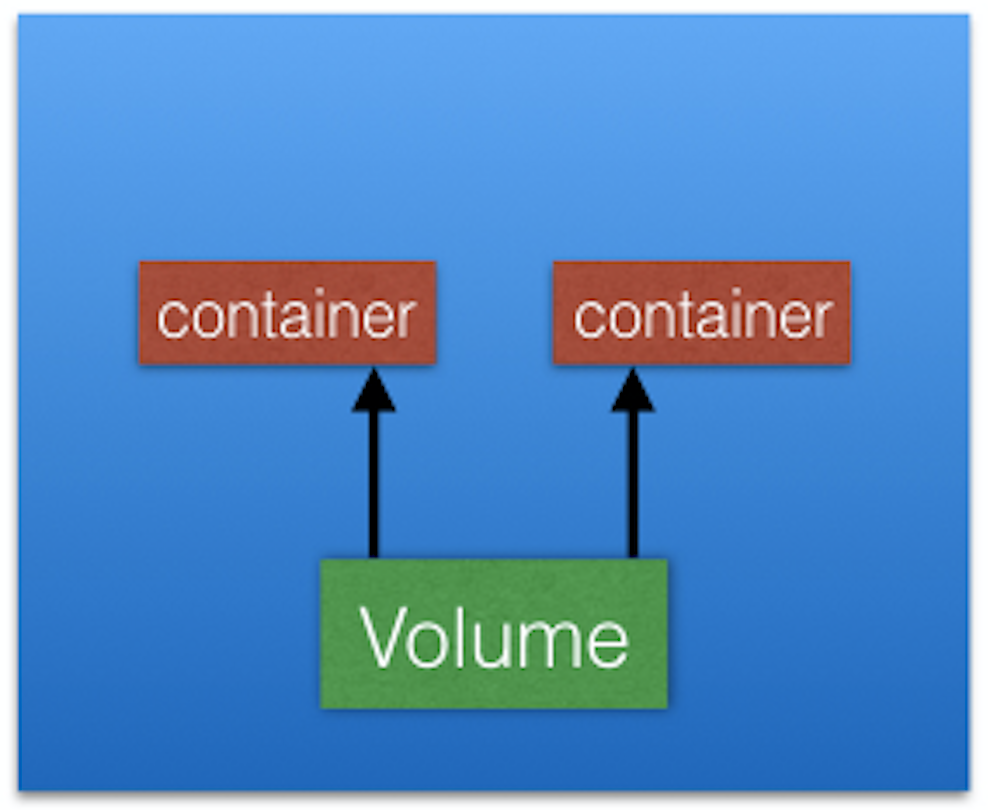
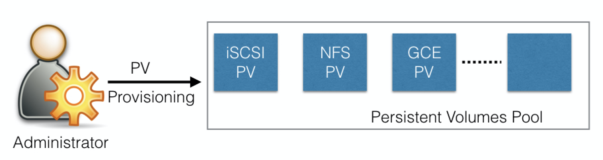
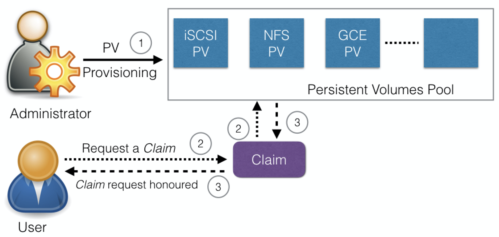
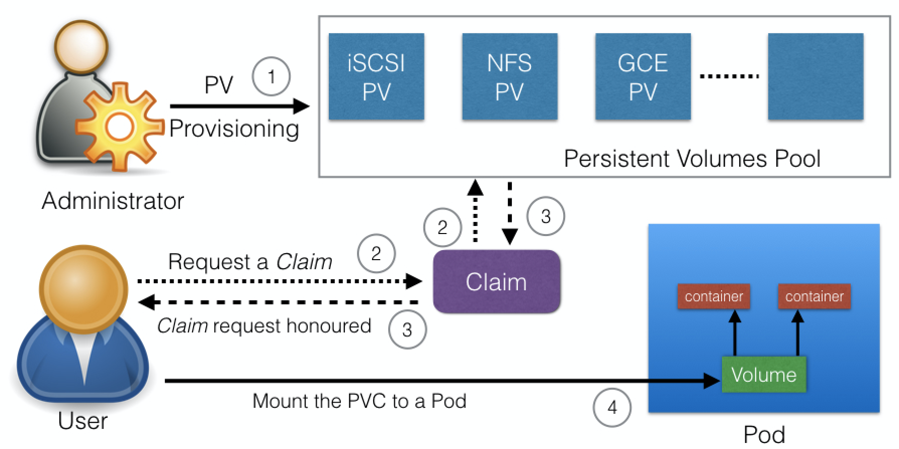

# Kubernetes Volume Management

## Introduction

To back a Pod with a persistent storage, Kubernetes uses `Volumes`. In this chapter, we will learn about Volumes and their types. We will also talk about `PersistentVolume` and `PersistentVolumeClaim` objects, which help us attach storage Volumes to Pods.

## Learning Objectives

By the end of this chapter, you should be able to:

- Explain the need for persistent data management.
- Discuss Kubernetes Volume and its types.
- Discuss PersistentVolumes and PersistentVolumeClaims.

## Volumes

As we know, containers, which create the Pods, are ephemeral in nature. All data stored inside a container is deleted if the container crashes. However, the kubelet will restart it with a clean state, which means that it will not have any of the old data.

To overcome this problem, Kubernetes uses [Volumes](https://kubernetes.io/docs/concepts/storage/volumes/). A Volume is essentially a directory backed by a storage medium. The storage medium and its content are determined by the Volume Type.

In Kubernetes, a Volume is attached to a Pod and shared among the containers of that Pod. The Volume has the same life span as the Pod, and it outlives the containers of the Pod - this allows data to be preserved across container restarts.

## Volume Types

A directory which is mounted inside a Pod is backed by the underlying Volume Type. A Volume Type decides the properties of the directory, like size, content, etc. Some examples of Volume Types are:

- **`emptyDir`**  
  An `empty` Volume is created for the Pod as soon as it is scheduled on the worker node. The Volume's life is tightly coupled with the Pod. If the Pod dies, the content of `emptyDir` is deleted forever.
- **`hostPath`**  
  With the `hostPath` Volume Type, we can share a directory from the host to the Pod. If the Pod dies, the content of the Volume is still available on the host.
- **`gcePersistentDisk`**  
  With the `gcePersistentDisk` Volume Type, we can mount a [Google Compute Engine (GCE) persistent disk](https://cloud.google.com/compute/docs/disks/) into a Pod.
- **`awsElasticBlockStore`**  
  With the `awsElasticBlockStore` Volume Type, we can mount an [AWS EBS Volume](https://aws.amazon.com/ebs/) into a Pod. 
- **`nfs`**  
  With [nfs](https://en.wikipedia.org/wiki/Network_File_System), we can mount an NFS share into a Pod.
- **`iscsi`**  
  With [iscsi](https://en.wikipedia.org/wiki/ISCSI), we can mount an iSCSI share into a Pod.
- **`secret`**  
  With the `secret` Volume Type, we can pass sensitive information, such as passwords, to Pods. We will take a look at an example in a later chapter.
- **`persistentVolumeClaim`**  
  We can attach a [PersistentVolume](https://kubernetes.io/docs/concepts/storage/persistent-volumes/) to a Pod using a `persistentVolumeClaim`. We will cover this in our next section. 

You can learn more details about Volume Types in the [Kubernetes documentation](https://kubernetes.io/docs/concepts/storage/volumes/).

## PersistentVolumes

In a typical IT environment, storage is managed by the storage/system administrators. The end user will just get instructions to use the storage, but does not have to worry about the underlying storage management.

In the containerized world, we would like to follow similar rules, but it becomes challenging, given the many Volume Types we have seen earlier. Kubernetes resolves this problem with the **PersistentVolume (PV)** subsystem, which provides APIs for users and administrators to manage and consume storage. To manage the Volume, it uses the PersistentVolume API resource type, and to consume it, it uses the PersistentVolumeClaim API resource type.

A Persistent Volume is a network-attached storage in the cluster, which is provisioned by the administrator.

PersistentVolumes can be dynamically provisioned based on the StorageClass resource. A StorageClass contains pre-defined provisioners and parameters to create a PersistentVolume. Using PersistentVolumeClaims, a user sends the request for dynamic PV creation, which gets wired to the StorageClass resource.

Some of the Volume Types that support managing storage using PersistentVolumes are:

- GCEPersistentDisk
- AWSElasticBlockStore
- AzureFile
- NFS
- iSCSI.

For a complete list, as well as more details, you can check out the Kubernetes documentation.

## PersistentVolumeClaims

A **PersistentVolumeClaim (PVC)** is a request for storage by a user. Users request for PersistentVolume resources based on size, access modes, etc. Once a suitable PersistentVolume is found, it is bound to a PersistentVolumeClaim.

After a successful bound, the PersistentVolumeClaim resource can be used in a Pod.

Once a user finishes its work, the attached PersistentVolumes can be released. The underlying PersistentVolumes can then be reclaimed and recycled for future usage. 

To learn more, you can check out the [Kubernetes documentation](https://kubernetes.io/docs/concepts/storage/persistent-volumes/#persistentvolumeclaims).

## Container Storage Interface (CSI)

At the time this course was created, container orchestrators like Kubernetes, Mesos, Docker or Cloud Foundry had their own way of managing external storage using Volumes.

For storage vendors, it is difficult to manage different Volume plugins for different orchestrators. Storage vendors and community members from different orchestrators are working together to standardize the Volume interface; a volume plugin built using a standardized CSI would work on different container orchestrators. You can find [CSI specifications](https://github.com/container-storage-interface/spec/blob/master/spec.md) here.

Kubernetes 1.9 added alpha support for CSI, which makes installing new CSI-compliant Volume plugins very easy. With CSI, third-party storage providers can develop solutions without the need to add them into the core Kubernetes codebase.

## Using the hostPath Volume Type Demo

[Using the hostPath Volume Type](https://youtu.be/6Z1CrunVg2w)

## Learning Objectives (Review)

You should now be able to:

- Explain the need for persistent data management.
- Discuss Kubernetes Volume and its types.
- Discuss PersistentVolumes and PersistentVolumeClaims.
