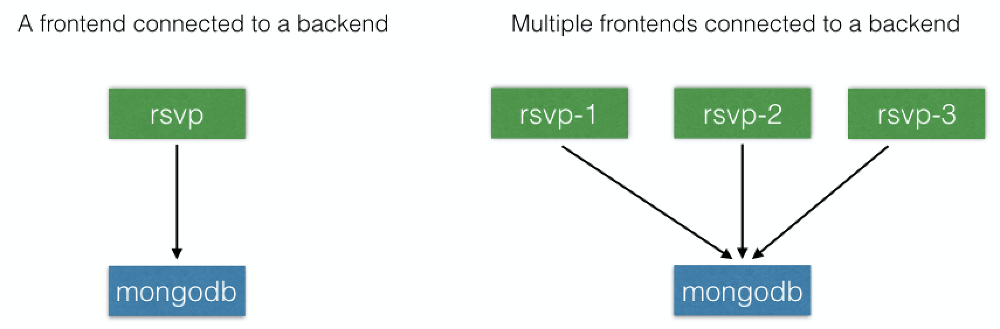
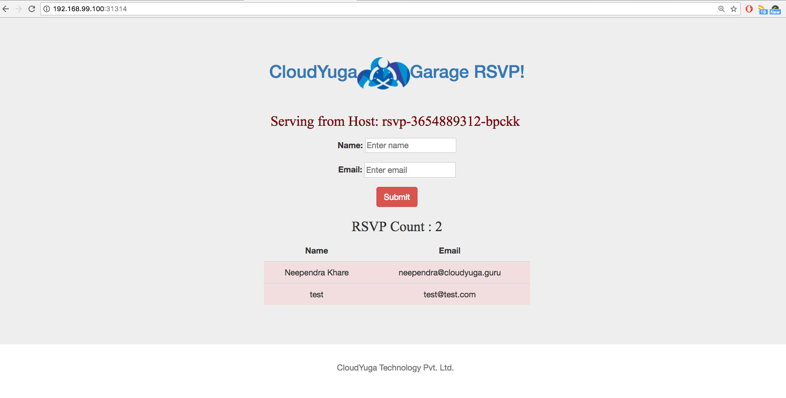

# Deploying a Multi-Tier Application

## Introduction

In a typical application, we have different tiers:

- Backend
- Frontend
- Caching, etc.

In this chapter, we will learn to deploy a multi-tier application with Kubernetes and then scale it.

## Learning Objectives

By the end of this chapter, you should be able to:

- Analyze a sample multi-tier application.
- Deploy a multi-tier application.
- Scale an application.

## RSVP Application

We will be using a sample **RSVP application**. Using this application, users can register for an event by providing their username and email ID. Once a user registers, his/her name and email appears in a table. The application consists of a backend database and a frontend. For the backend, we will be using a MongoDB database, and for the frontend, we have a Python Flask-based application.



The application's code is available [here](https://github.com/cloudyuga/rsvpapp). In the frontend code (`rsvp.py`), we will look for the `MONGODB_HOST` environment variable for the database endpoint, and, if it is set, we will connect to it on port `27017`.

```
MONGODB_HOST=os.environ.get('MONGODB_HOST', 'localhost')
client = MongoCLient(MONGODB_HOST, 27017)
```

After deploying the application with one backend and one frontend, we will scale the frontend to explore the scaling feature of Kubernetes. 

Next, we will deploy the MongoDB database - for this, we will need to create a Deployment and a Service for MongoDB.

## Create the Deployment for MongoDB

Create an rsvp-db.yaml file with the following content:

```yaml
apiVersion: apps/v1
kind: Deployment
metadata:
  name: rsvp-db
  labels:
    appdb: rsvpdb
spec:
  replicas: 1
  selector:
    matchLabels:
      appdb: rsvpdb
  template:
    metadata:
      labels:
        appdb: rsvpdb
    spec:
      containers:
      - name: rsvp-db
        image: mongo:3.3
        ports:
        - containerPort: 27017
```

and run the following command to create the rsvp-db Deployment:

```
$ kubectl create -f rsvp-db.yaml
deployment "rsvp-db" created
```

## Create the Service for MongoDB

To create a `mongodb` Service for the backend, create an `rsvp-db-service.yaml` file with the following content:

```yaml
apiVersion: v1
kind: Service
metadata:
  name: mongodb
  labels:
    app: rsvpdb
spec:
  ports:
  - port: 27017
    protocol: TCP
  selector:
    appdb: rsvpdb
```

and run the following command to create a Service named `mongodb` to access the backend:

```
$ kubectl create -f rsvp-db-service.yaml
service "mongodb" created
```

As we did not specify any _ServiceType_, `mongodb` will have the default ClusterIP _ServiceType_. This means that the `mongodb` Service will not be accessible from the external world.

## Check Out the Available Deployments and Services

Next, we will check out the Deployments and Services currently available:

```
$ kubectl get deployments
NAME        DESIRED   CURRENT   UP-TO-DATE   AVAILABLE   AGE
rsvp-db     1         1         1            1           10m

$ kubectl get services
NAME          CLUSTER-IP    EXTERNAL-IP    PORT(S)        AGE
kubernetes    10.0.0.1      <none>         443/TCP        24d
mongodb       10.0.0.32     <none>         27017/TCP      8m
```

## Deploy the Python Flask-Based Frontend

The frontend is created using a [Python Flask-based microframework](http://flask.pocoo.org/). Its source code is available here. We have created a Docker image called [teamcloudyuga/rsvpapp](https://hub.docker.com/r/teamcloudyuga/rsvpapp/), in which we have imported the application's source code. The application's code is executed when a container created from that image runs. The Dockerfile to create the `teamcloudyuga/rsvpapp` image is available [here](https://raw.githubusercontent.com/cloudyuga/rsvpapp/master/Dockerfile).

Next, we will go through the steps of creating the **rsvp** frontend.

## Create the Deployment for the 'rsvp' Frontend

To create the **rsvp** frontend, create an `rsvp-web.yaml` file, with the following content:

```yaml
apiVersion: apps/v1
kind: Deployment
metadata:
  name: rsvp
  labels:
    app: rsvp
spec:
  replicas: 1
  selector:
    matchLabels:
      app: rsvp
  template:
    metadata:
      labels:
        app: rsvp
    spec:
      containers:
      - name: rsvp-app
        image: teamcloudyuga/rsvpapp
        env:
        - name: MONGODB_HOST
          value: mongodb
        ports:
        - containerPort: 5000
          name: web-port
```

and run the following command to create the Deployment:

```
$ kubectl create -f rsvp-web.yaml
deployment "rsvp" created
```

While creating the Deployment for the frontend, we are passing the name of the MongoDB Service, `mongodb`, as an environment variable, which is expected by our frontend.

Notice that in the `ports` section we mentioned the `containerPort 5000`, and given it the `web-port` name. We will be using the referenced `web-port` name while creating the Service for the `rsvp` application. This is useful, as we can change the underlying `containerPort` without making any changes to our Service.

## Create the Service for the 'rsvp' Frontend

To create the **rsvp** Service for our frontend, create an `rsvp-web-service.yaml` file with the following content:

```yaml
apiVersion: v1
kind: Service
metadata:
  name: rsvp
  labels:
    app: rsvp
spec:
  type: NodePort
  ports:
  - port: 80
    targetPort: web-port
    protocol: TCP
  selector:
    app: rsvp
```

and run the following command to create the Service:

```
$ kubectl create -f rsvp-web-service.yaml
service "rsvp" created
```

You may notice that we have mentioned the `targetPort` in the `ports` section, which will forward all the requests coming on port `80` for the ClusterIP to the referenced `web-port` port (`5000`) on the connected Pods. We can describe the Service and verify it.

## Check Out the Available Deployments and Services

Next, we will check out the Deployments and Services currently available:

```
$ kubectl get deployments
NAME        DESIRED   CURRENT   UP-TO-DATE   AVAILABLE   AGE
rsvp        1         1         1            1           40m
rsvp-db     1         1         1            1           1h

$ kubectl get services
NAME          CLUSTER-IP   EXTERNAL-IP   PORT(S)        AGE
kubernetes    10.0.0.1     <none>        443/TCP        25d
mongodb       10.0.0.32    <none>        27017/TCP      1h
rsvp          10.0.0.225   <nodes>       80:31314/TCP   7m
```

## Access the RSVP Application from the Workstation

While deploying the frontend's Service, we have used NodePort as the _ServiceType_, which has configured `port 31314` on the Minikube VM to access the application. Please note that on your setup, the configured port for NodePort may be different than ours. For this chapter, please use that respective port wherever we use  `port 31314`. Let's now get the IP address for Minikube:

```
$ minikube ip
192.168.99.100
```

and open a browser to access the application at `http://192.168.99.100:31314`. Once opened, fill out the required entries using the frontend, which will be saved in the backend database.



Or we can just use the minikube service command to access the application on the browser:

`$ minikube service rsvp`

## Scale the Frontend

Currently, we have one replica running for the frontend. To scale it to 4 replicas, we can use the following command:

```
$ kubectl scale deployment rsvp --replicas=3
deployment "rsvp" scaled
```

We can verify if it scaled correctly by looking at the Deployments:

```
$ kubectl get deployments
NAME         DESIRED   CURRENT   UP-TO-DATE   AVAILABLE   AGE
rsvp         3         3         3            3           1h
rsvp-db      1         1         1            1           1h
```

If we go to the browser and refresh the frontend, the **hostname** printed after the **Serving from Host** text keeps changing: **rsvp-3654889312-b51fn**, **rsvp-3654889312-s7738**, and so on. This is because the **hostname** is coming from the underlying Pod and, when we refresh the page, we hit different endpoints from our Service.

## Deploying a Multi-Tier Application Demo

[Deploying a Multi-Tier Application](https://youtu.be/Tywdpr3tWLo)

## Learning Objectives (Review)

You should now be able to:

- Analyze a sample multi-tier application.
- Deploy a multi-tier application.
- Scale an application.
