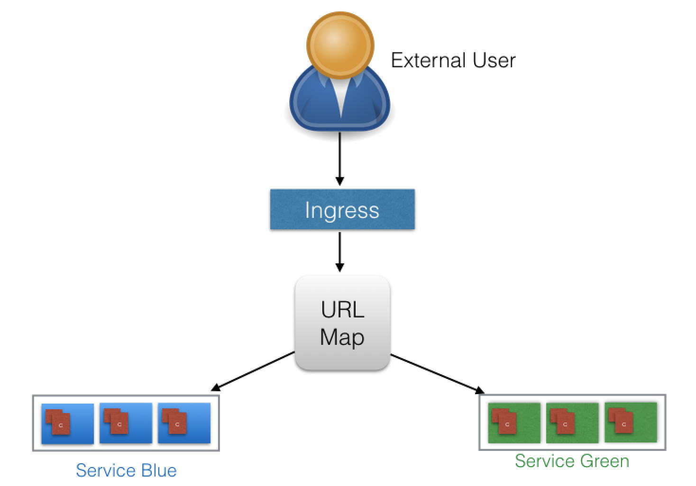
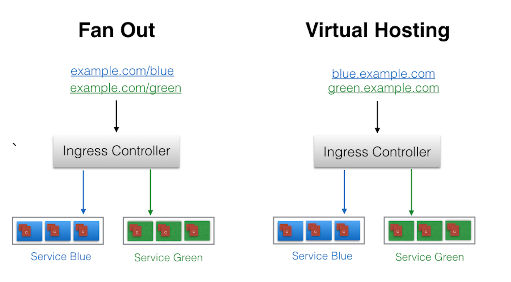

# Ingress

## Introduction

In _Chapter 9. Services_, we saw how we can access our deployed containerized application from the external world. Among the _ServiceTypes_ mentioned in that chapter, NodePort and LoadBalancer are the most often used. For the LoadBalancer _ServiceType_, we need to have the support from the underlying infrastructure. Even after having the support, we may not want to use it for every Service, as LoadBalancer resources are limited and they can increase costs significantly. Managing the NodePort _ServiceType_ can also be tricky at times, as we need to keep updating our proxy settings and keep track of the assigned ports. In this chapter, we will explore the **Ingress**, which is another method we can use to access our applications from the external world.

## Learning Objectives

By the end of this chapter, you should be able to:

- Explain what Ingress and Ingress Controllers are.
- Learn when to use Ingress.
- Access an application from the external world using Ingress.

## Ingress

With Services, routing rules are attached to a given Service. They exist for as long as the Service exists. If we can somehow decouple the routing rules from the application, we can then update our application without worrying about its external access. This can be done using the Ingress resource. 

According to [kubernetes.io](https://kubernetes.io/docs/concepts/services-networking/ingress/),

> "An Ingress is a collection of rules that allow inbound connections to reach the cluster Services."

To allow the inbound connection to reach the cluster Services, Ingress configures a Layer 7 HTTP load balancer for Services and provides the following:

- TLS (Transport Layer Security)
- Name-based virtual hosting 
- Path-based routing
- Custom rules.



With Ingress, users don't connect directly to a Service. Users reach the Ingress endpoint, and, from there, the request is forwarded to the respective Service. You can see an example of a sample Ingress definition below:

```yaml
apiVersion: extensions/v1beta1
kind: Ingress
metadata:
  name: web-ingress
  namespace: default
spec:
  rules:
  - host: blue.example.com
    http:
      paths:
      - backend:
          serviceName: webserver-blue-svc
          servicePort: 80
  - host: green.example.com
    http:
      paths:
      - backend:
          serviceName: webserver-green-svc
          servicePort: 80
```

According to the example we provided above, users requests to both `blue.example.com` and `green.example.com` would go to the same Ingress endpoint, and, from there, they would be forwarded to `webserver-blue-svc`, and `webserver-green-svc`, respectively. Here, we have seen an example of a Name-Based Virtual Hosting Ingress rule. 

We can also have Fan Out Ingress rules, in which we send requests like `example.com/blue` and `example.com/green`, which would be forwarded to `webserver-blue-svc` and `webserver-green-svc`, respectively.



The Ingress resource does not do any request forwarding by itself. All of the magic is done using the Ingress Controller, which we will discuss next.

## Ingress Controller

An [Ingress Controller](https://kubernetes.io/docs/concepts/services-networking/ingress/#ingress-controllers) is an application which watches the Master Node's API server for changes in the Ingress resources and updates the Layer 7 Load Balancer accordingly. Kubernetes has different Ingress Controllers, and, if needed, we can also build our own. [GCE L7 Load Balancer](https://github.com/kubernetes/ingress-gce/blob/master/README.md) and [Nginx Ingress Controller](https://github.com/kubernetes/ingress-nginx/blob/master/README.md) are examples of Ingress Controllers. 

### Start the Ingress Controller with Minikube

Minikube v0.14.0 and above ships the Nginx Ingress Controller setup as an add-on. It can be easily enabled by running the following command:

`$ minikube addons enable ingress`

## Deploy an Ingress Resource

Once the Ingress Controller is deployed, we can create an Ingress resource using the `kubectl create` command. For example, if we create a `webserver-ingress.yaml` file with the content that we saw on the _Ingress_ page, then, we will use the following command to create an Ingress resource:

`$ kubectl create -f webserver-ingress.yaml`

## Access Services Using Ingress

With the Ingress resource we just created, we should now be able to access the `webserver-blue-svc` or `webserver-green-svc` services using the `blue.example.com` and `green.example.com` URLs. As our current setup is on Minikube, we will need to update the host configuration file (`/etc/hosts` on Mac and Linux) on our workstation to the Minikube IP for those URLs:

```
$ cat /etc/hosts
127.0.0.1        localhost
::1              localhost
192.168.99.100   blue.example.com green.example.com 
```

Once this is done, we can open `blue.example.com` and `green.example.com` on the browser and access the application.

## Using Ingress Rules to Access an Application Demo

[Using Ingress Rules to Access an Application](https://youtu.be/Blmw3kTSHCs)

## Learning Objectives (Review)

You should now be able to:

- Explain what Ingress and Ingress Controllers are.
- Learn when to use Ingress.
- Access an application from the external world using Ingress.
