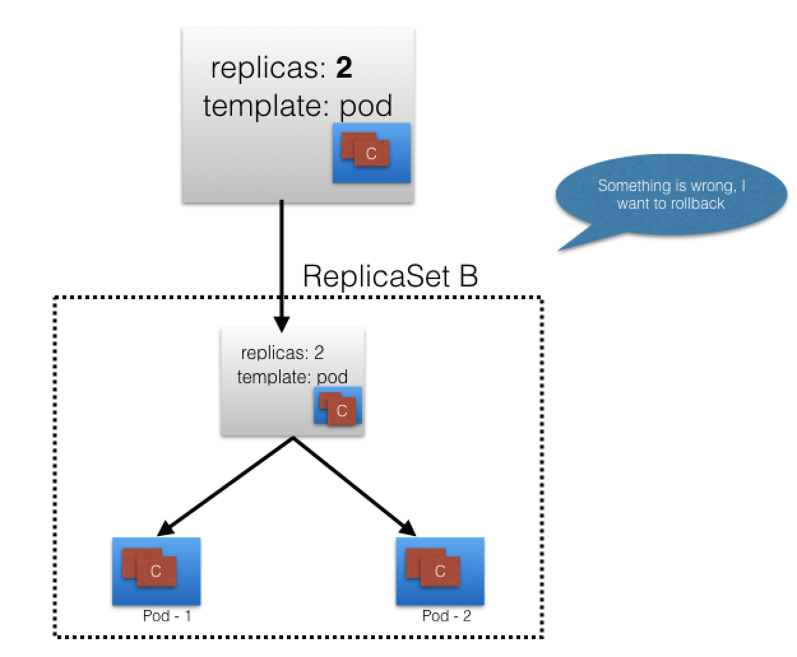

# Advanced Topics - Overview

## Introduction

So far, in this course, we have spend most of our time understanding the basic Kubernetes concepts and simple workflows to build a solid foundation. To support enterprise class production workloads, Kubernetes can do auto-scaling, rollbacks, quota management, RBAC, etc. In this chapter, we will get a high-level overview about such advanced topics, but diving into details would be out of scope for this course. 

## Learning Objectives

By the end of this chapter, you should be able to:

- Discuss advanced Kubernetes concepts: DaemonSets, StatefulSets, Helm, etc.

## Annotations

With [Annotations](https://kubernetes.io/docs/concepts/overview/working-with-objects/annotations/), we can attach arbitrary non-identifying metadata to any objects, in a key-value format:

```yaml
"annotations": {
  "key1" : "value1",
  "key2" : "value2"
}
```

In contrast to Labels, annotations are not used to identify and select objects. Annotations can be used to:

- Store build/release IDs, PR numbers, git branch, etc.
- Phone/pager numbers of people responsible, or directory entries specifying where such information can be found
- Pointers to logging, monitoring, analytics, audit repositories, debugging tools, etc.
- Etc.

For example, while creating a Deployment, we can add a description like the one below:

```yaml
apiVersion: extensions/v1beta1
kind: Deployment
metadata:
  name: webserver
  annotations:
    description: Deployment based PoC dates 2nd June'2017
....
```

We can look at annotations while describing an object:

```
$ kubectl describe deployment webserver
Name:                webserver
Namespace:           default
CreationTimestamp:   Sat, 03 Jun 2017 05:10:38 +0530
Labels:              app=webserver
Annotations:         deployment.kubernetes.io/revision=1
                     description=Deployment based PoC dates 2nd June'2017
...
```

## Deployment Features

Earlier, we have seen how we can use the Deployment object to deploy an application. This is just a basic functionality. We can do more interesting things, like recording a Deployment - if something goes wrong, we can revert to the working state.

The graphic below depicts a situation in which our update fails:



If we have recorded our Deployment before doing the update, we can revert back to a known working state.


In addition, the Deployment object also provides the following features:

- Autoscaling
- Proportional scaling
- Pausing and resuming.

To learn more, check out the available [Kubernetes documentation](https://kubernetes.io/docs/concepts/workloads/controllers/deployment/#scaling-a-deployment).

## Jobs

A [Job](https://kubernetes.io/docs/concepts/workloads/controllers/jobs-run-to-completion/#what-is-a-job) creates one or more Pods to perform a given task. The Job object takes the responsibility of Pod failures. It makes sure that the given task is completed successfully. Once the task is over, all the Pods are terminated automatically.

Starting with the Kubernetes 1.4 release, we can also perform Jobs at specified times/dates, such as [cron jobs](https://kubernetes.io/docs/concepts/workloads/controllers/cron-jobs/).

## Quota Management

When there are many users sharing a given Kubernetes cluster, there is always a concern for fair usage. A user should not take undue advantage. To address this concern, administrators can use the [ResourceQuota](https://kubernetes.io/docs/concepts/policy/resource-quotas/) object, which provides constraints that limit aggregate resource consumption per Namespace.

We can have the following types of quotas per Namespace:

- **Compute Resource Quota**  
  We can limit the total sum of compute resources (CPU, memory, etc.) that can be requested in a given Namespace.
- **Storage Resource Quota**  
  We can limit the total sum of storage resources (PersistentVolumeClaims, requests.storage, etc.) that can be requested.
- **Object Count Quota**  
  We can restrict the number of objects of a given type (pods, ConfigMaps, PersistentVolumeClaims, ReplicationControllers, Services, Secrets, etc.).

## DaemonSets

In some cases, like collecting monitoring data from all nodes, or running a storage daemon on all nodes, etc., we need a specific type of Pod running on all nodes at all times. A [DaemonSet](https://kubernetes.io/docs/concepts/workloads/controllers/daemonset/) is the object that allows us to do just that. 

Whenever a node is added to the cluster, a Pod from a given DaemonSet is created on it. When the node dies, the respective Pods are garbage collected. If a DaemonSet is deleted, all Pods it created are deleted as well.

## StatefulSets

The StatefulSet controller is used for applications which require a unique identity, such as name, network identifications, strict ordering, etc. For example, `MySQL cluster`, `etcd cluster`.

The StatefulSet controller provides identity and guaranteed ordering of deployment and scaling to Pods.

## Kubernetes Federation

With the [Kubernetes Cluster Federation](https://kubernetes.io/docs/concepts/cluster-administration/federation/) we can manage multiple Kubernetes clusters from a single control plane. We can sync resources across the clusters and have cross-cluster discovery. This allows us to do Deployments across regions and access them using a global DNS record.

The Federation is very useful when we want to build a hybrid solution, in which we can have one cluster running inside our private datacenter and another one on the public cloud. We can also assign weights for each cluster in the Federation, to distribute the load as per our choice.

## Custom Resources

In Kubernetes, a **resource** is an API endpoint which stores a collection of API objects. For example, a Pod resource contains all the Pod objects.

Although in most cases existing Kubernetes resources are sufficient to fulfill our requirements, we can also create new resources using **custom resources**. With custom resources, we don't have to modify the Kubernetes source.

Custom resources are dynamic in nature, and they can appear and disappear in an already running cluster at any time.

To make a resource declarative, we must create and install a **custom controller**, which can interpret the resource structure and perform the required actions. Custom controllers can be deployed and managed in an already running cluster.

There are two ways to add custom resources:

- [Custom Resource Definitions (CRDs)](https://kubernetes.io/docs/concepts/api-extension/custom-resources/)  
  This is the easiest way to add custom resources and it does not require any programming knowledge. However, building the custom controller would require some programming.
- [API Aggregation](https://kubernetes.io/docs/concepts/api-extension/apiserver-aggregation/)  
  For more fine-grained control, we can write API Aggregators. They are subordinate API servers which sit behind the primary API server and act as proxy.

## Helm

To deploy an application, we use different Kubernetes manifests, such as Deployments, Services, Volume Claims, Ingress, etc. Sometimes, it can be tiresome to deploy them one by one. We can bundle all those manifests after templatizing them into a well-defined format, along with other metadata. Such a bundle is referred to as _Chart_. These Charts can then be served via repositories, such as those that we have for `rpm` and `deb` packages.

[Helm](https://github.com/kubernetes/helm) is a package manager (analogous to `yum` and `apt`) for Kubernetes, which can install/update/delete those Charts in the Kubernetes cluster.

Helm has two components:

- A client called _helm_, which runs on your user's workstation
- A server called _tiller_, which runs inside your Kubernetes cluster.

The client _helm_ connects to the server _tiller_ to manage Charts. Charts submitted for Kubernetes are available [here](https://github.com/kubernetes/charts).

## Monitoring and Logging

In Kubernetes, we have to collect resource usage data by Pods, Services, nodes, etc., to understand the overall resource consumption and to make decisions for scaling a given application. Two popular Kubernetes monitoring solutions are Heapster and Prometheus.

- **Heapster**  
  [Heapster](https://kubernetes.io/docs/tasks/debug-application-cluster/resource-usage-monitoring/) is a cluster-wide aggregator of monitoring and event data, which is natively supported on Kubernetes. 
- **Prometheus**  
  [Prometheus](https://prometheus.io/), now part of [CNCF](https://www.cncf.io/) (Cloud Native Computing Foundation), can also be used to scrape the resource usage from different Kubernetes components and objects. Using its client libraries, we can also instrument the code of our application.

Another important aspect for troubleshooting and debugging is Logging, in which we collect the logs from different components of a given system. In Kubernetes, we can collect logs from different cluster components, objects, nodes, etc. The most common way to collect the logs is using [Elasticsearch](https://kubernetes.io/docs/tasks/debug-application-cluster/logging-elasticsearch-kibana/), which uses [fluentd](http://www.fluentd.org/) with custom configuration as an agent on the nodes. **fluentd** is an open source data collector, which is also part of CNCF.

## Learning Objectives (Review)

You should now be able to:

- Discuss advanced Kubernetes concepts: DaemonSets, StatefulSets, Helm, etc.
